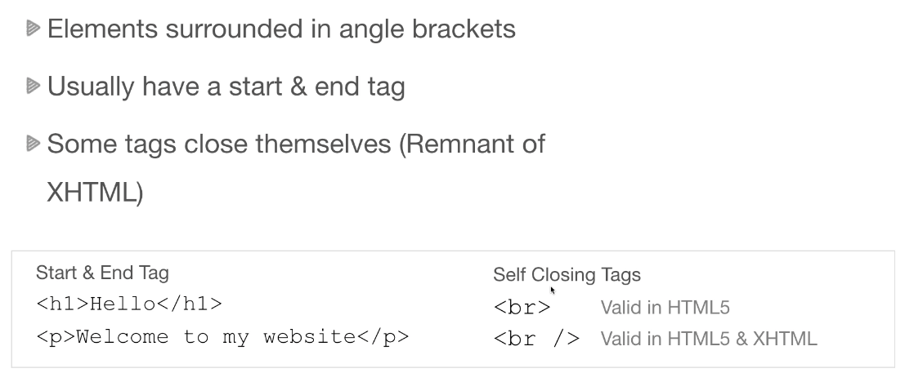
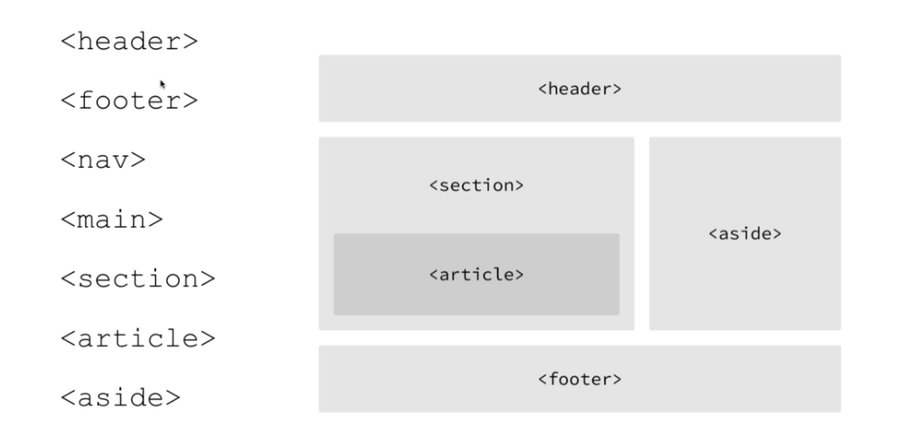
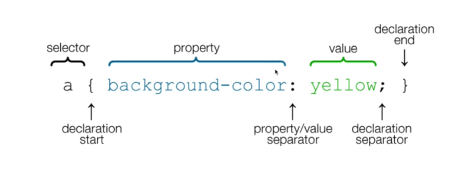
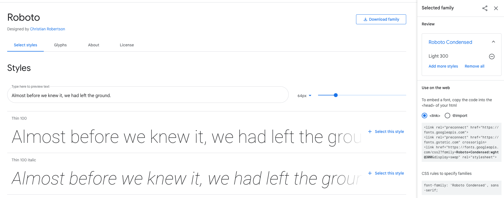
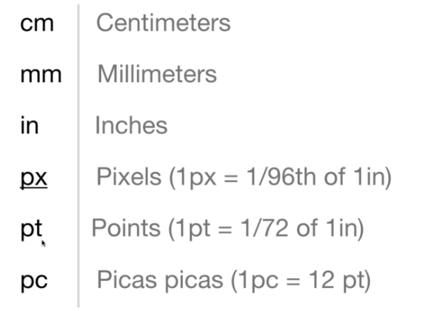
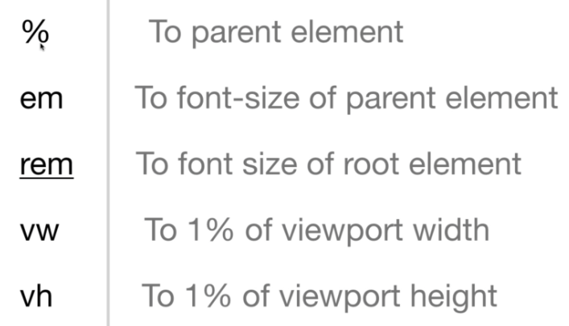
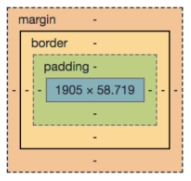

# Fundamentals

[toc]

## Contents

This course is for both beginners and seasoned developers that want to learn
how to build responsive websites and user interfaces with modern HTML5 and
CSS3+ technologies like Flexbox and CSS Grid as well as the Sass pre-compiler.
This course includes hours of both learning & studying sections along with real
life projects. Stop having to rely on frameworks like Bootstrap for your user
interface and learn how to create your own layouts and utility classes to build
custom responsive websites and app UIs.

## My Note

- Basics of How website works
- Setup & Tools
- HTML 5
- CSS Fundamentals
- Responsive Design
- Flexbox
- CSS Grid
- Animation (transitions, keyframes, ... etc.)
- CSS variables, transform, Psedudo slectors,
- Sitcky menus Overlays form styling, landing pages,
- website deployment, Shared Host & Netlifty
- Sass CSS pre-commpiler
-

## Web Server

Websites/ webpages are files stored on computers with run a piece of software called a web server.
Basically you will need two things:
- Hosting companies, provide spce on a server, webServer (Apache, Nginx, ... etc.)
- A Domain names, `TLD`: `Top-level domain`,

`DNS` : is used to map IP addresses to domain names.

## Process of loading a webpages

```shell
DNS (Server): google.com 192.168.1.4 --> 192.168.1.4 <--  Web Browser--> 192.168.1.4 <-- Server
                                                            -> webpage -> www.google.com <- User
```

# Useful tips and tricks

- [x] In html file use (`!`) and (Inter) to get the direct
- [x] use `p` to use the `emmet` then hit enter to get a paragraph.
- [x] Adding a comment in `HTML`.
    - ```<!--- Adding a comment --- > ```
- [x] You can add new line using (command + enter) at any place in `HTML`
- [x] You can add a dummy text file using (Lorem + enter) or (Lorem 10 + enter) to add only `10` words.
- [x] You can use this trick to add a quick attribute with id ``` <!-- You can write div#about then hit enter to get emmet working -->``` or ```<!-- In case of div you can use directly # + Enter -->```
- [x] `div` is a block separator, used mainly to highlight a block.
- [x] `span` is inline separator, which usually we use to add a style for a specific inline element (e.g, word, paragraph ... etc.).
- [x] We can add a copyright using `&copy` symbol.
- [x] For including space or copyright or other symbols, including `code snippets` or `keyboard` shortcuts, check the `html entities section`.
- [x] You can also download a given section from any html page (like tables or other) by first right click and inspect the element (e.g., table) then see where it is located in the source code to copy it, I use `Google Chrome` to conduct this action.

- [x] `node` and `elment` are same, can be used exchangabliy.
- [x] Element also can be refered to as `tag`, (e.g. body, h1 , p , .... etc.)
- [x] `node` and `elment` are same, can be used exchangabliy.
- [x] About the color refer to
  - To get specific color, shade, tints ..etc., use [color-hex](https://www.color-hex.com/)
  - To generate a specific pallette use [colors palette](https://coolors.co/351431-775253-bdc696-d1d3c4-dfe0dc)

# 1. HTML Fundamentals
## The Roles of HTML, CSS in WebDev:

- What is HTML?
- Tags & Attributes
- Page & Structure
- Meta Tags
- VSCode Live Server Setup
- Keyboard Shortcuts
- Forms & Inputs &
- Links & Images
- Tables & Lists &Block vs Inline
- Div, Span, ID, Class
- HTML Entities,
- HTML5 Semantic Tags.

### Tag Syntax

<br> means **line break**
</>




### Doctype & basic Layout
Use (`!`) for getting the code snippet for `Emmet` generator.

### Meta Tags and Search Engines

- for charaset to know the formater of the html file.
    - ``` <meta charset="UTF-8">```
- Responsive design meta, you can add
    - ```name = viewport content = 'width=device-width, initial -scale=1.0```
- http-equiv to check the compatability to which borswer.
    - ```<meta http-equiv="X-UA-Compatible" content="IE=chrome"```

- Adding description that will be shown in the google engine sit under your website link.
    - ```<meta description="description" content="This is my website">```.
- Adding a keywords for your website
    - ```<meta name = "keywords" content="Web development, web design, other keywords">```
- If you want your website to not be shown in `Googel search engine` or not being indexed by any other engine, for example for privacy or other considerations, use:
    - ```<meta name = "robots" content="index, follow">```

### Headings, Paragraphs, Typography.

- You can add new line using (command + enter) at any place in `HTML`
- You can add a dummy text file using (Lorem + enter) or (Lorem 10 + enter) to add only `10` words.

```html
<!--Definition and Usage -- >
<!--The <div> tag defines a division or a section in an HTML document. -->
<!-- The <div> tag is used as a container for HTML elements - which is then styled with CSS or manipulated with JavaScript.-->
<!-- The <div> tag is easily styled by using the class or id attribute.-->
<!--Any sort of content can be put inside the <div> tag!  -->
<!-- Note: By default, browsers always place a line break before and after the <div> element.-->

<h1> Welcome to my World </h1>
<h2>Welcome to my World </h2>
<h3>Welcome to my World </h3>
<h4>Welcome to my World </h4>
<h5>Welcome to my World </h5>
<h6>Welcome to my World </h6>
<p>Welcome to my Second World </p>
<p>Welcome to my Third World </p>
<!-- Adding a line break -->
<br></br>
<p> Welcome to my World </p>
<!-- Adding a horizontal line -->
<hr></>
<p> Lorem ipsum, dolor sit amet consectetur adipisicing elit. Ea tempore eaque, cumque nemo dolores minima illum distinctio saepe necessitatibus totam amet maxime dignissimos atque dicta explicabo veritatis blanditiis, ullam debitis </p>

<! -- The tag of b, s, u and others are deprecated in HTML5 browsers -- >
<! -- The purpose is that styling now exlucsively is done using css -- >
<! -- the only exception is the tag for deleting called <del> --- >

```

### Links, images & attributes

For the current file system you can follow the ideal issue

```html

    <!-- External Link -->
    <h1>External Link</h1>
    <p> Here we can add some links to our current script </p>
    <!-- This will jump to google and leave your website -->
    <h2> This will jump to google and leave your website </h2>
    <p> Here we add a link that will jump and leave your current website. </p>
    <a href="http://www.google.com">Google</a>

    <hr>
    <!-- This will open the link in a new tab  -->
    <h2> This will open the link in a new tab </h2>
    <p> Here we add a link that will open in a new tab. </p>
    <a href="http://www.google.com" target="_blank">Google</a> </a>
    <br></br>
    <! -- Internal link ---- >
    <a href="./01_basic_layout.html">Internal internally to the basic layout Link</a>
    <br></br>

    <!-- Local image -->
    <!-- Alternative text, if the image is not there, the text will be shown -->
    <!-- we can add attribute called with for contorlling the image width, hight, although it is not recommneded as we will do all these in css -->
    
    <br></br>

    <!-- External image -->
    
    <br></br>
    

```

### Lists and tables

```html

<!-- Tables -->
<!-- Tables are used to display data in a structured way, Tables are used for tabulated data -->
<!-- we can use the style attribute but we will not use it for now as we will use later the css to control the table layout -->
<h2> Tables </h2>
<table style="width:500px">
    <thead>
        <tr>
            <th>Name</th>
            <th>Age</th>
            <th>Email Address</th>
        </th>
    </thead>
    <tbody>
        <tr>
            <td>John</td>
            <td>25</td>
            <td>John@example.com</td>
        </tr>
        <tr>
            <td>Jane</td>
            <td>32</td>
            <td>Jane@example.com</td>
        </tr>
        <tr>
            <td>Mary</td>
            <td>18</td>
            <td>Mary@example.com</td>
        </tr>

</table>
```

### Forms and Inputs Fields

The forms and input fields are going to be displayed with  `HTML5` while the arg to refere to which language to be used in the `back-end` are passed using `action` attribute such as, `action="process.phd"`.
- Notice that the reset button can clear all the fields nested under the given form tag.


```html

    <h1 inputs and forms >Inputs and forms</h1>
    <!-- If you add the for and the id you can get the feature of clicking on the name (Name), then it will highligh your input form for same name you give "INPUTX", while the (VARX) will be grabbed to be used in the back-end server as a value to play with -->
    <form action="">
        <div>
            <label for="INPUTX">Name</label><br>
            <input type="text" name="VARX" id="INPUTX", placeholder="input your name">
        </div>

        <div>
            <label for="INPUTY">Email</label><br>
            <input type="email" name="VARY" id="INPUTY", placeholder= "your email address">

        </div>

        <div>

            <label for="INPUTZ">Password</label><br>
            <input type="password" name="VARZ" id="INPUTZ", placeholder="your password">
        </div>

        <div>

        <label for="message">Message</label><br>
            <textarea name="message" id="message" cols="30" rows="10">Here is a default message.
            </textarea>
        </div>
        <!-- Select form -->
        <h1> Select form </h1>
        <div>
            <label for="select">Select from the down menu</label><br>
            <select name="select" id="select">
                <option value="1">First option in our list</option>
                <option value="2" selected>Second option in our list</option>
                <option value="3">Third option in our list</option>
            </select>
        </div>

        <!-- Number form -->
        <h1> Number form </h1>
        <div>
        <label for = "age"> Age</label><br>
        <input type = "number" name = "age" id = "age", placeholder= "Specificy your age">
        </div>
        <!-- date form -->
        <h1> Date form </h1>
        <div>
        <label for = "date"> BirthDate</label><br>
        <input type = "date" name = "date" id = "date">
        </div>
        <!-- Radio form -->
        <!-- adding the attribute checked will be the default -->
        <h1> Radio form </h1>
        <div>
            <label for="membership">Select your Membership</label><br>
            <input type = "radio" name = "membership" value = "simple" id = "membership"> Simple<br>
            <input type = "radio" name = "membership" value = "simple" id = "membership" checked> Standard<br>
            <input type = "radio" name = "membership" value = "simple" id = "membership"> Super<br>
        </div>

        <!-- Checkbox form -->
        <h1> Checkbox form </h1>
        <div>
            <label for="checkbox">Select your Membership</label><br>
            <input type = "checkbox" name = "checkbox" value = "Simple" id = "checkbox"> Simple<br>
            <input type = "checkbox" name = "checkbox" value = "Standard" id = "checkbox" checked> Standard<br>
            <input type = "checkbox" name = "checkbox" value = "Super" id = "checkbox"> Super<br>
        </div>

        <!-- Submit button -->
        <h1>Using button tag</h1>
        <h2> submit button</h2>
        <div>
            <input type="submit" value="Submit">
        </div>
        <div>
            <h2>submit with tag</h2>
            <button type="submit">Submit</button>

        </div>

    </form>
```


### Block & Inline Level Elements

#### Block Elements
spand across the html,

[block and inline elements in html](https://www.w3schools.com/html/html_blocks.asp)
```html
Here are the block-level elements in HTML:

<address><article><aside><blockquote><canvas><dd><div><dl><dt>
<fieldset><figcaption><figure><footer><form><h1>-<h6><header>
<hr><li><main><nav><noscript><ol><p><pre><section><table><tfoot><ul><video>
```
#### Inline Elements
on line spaning and will will contiue the next element on right side of the previous inline element.

```html
<a><abbr><acronym><b><bdo><big><br><button><cite><code><dfn><em><i>
<input><kbd><label><map><object><output><q><samp><script>
<select><small><span><strong><sub><sup><textarea><time><tt><var>
```

for example `div` is pushing things down and it’s a block element
### Divs & Spans, Classes & ids

Difference between `ids` and `classes` is that `ids` are unique to a given html element, while class can be repeated multiple elements. This will be explained more in details later in `css` section.

- [x] `div` is a block separator, used mainly to highlight a block.
- [x] `span` is inline separator, which usually we use to add a style for a specific inline element (e.g, word, paragraph ... etc.).
- [x] We can add a copyright using `&copy` symbol.

```html

<body>
    <!-- Adding style here is not desrivable and its for demonstration purposes only-->
    <style>
        .card{
            border: 1px solid black;
            background-color: #f4f4f4;
            padding:20px;
            margin-bottom: 10px;
        }
        .enhance{
            color : red;
            background-color: yellow;
            padding:1px;
            margin-bottom: 10px;

        }
    </style>
    <div id = "main-header">
        <h1>My Website</h1>
        <p>A site about me, here is how to use the div</p>
    </div>
    <!-- Adding a navigation menu -->
    <ul id="main-nav">
        <li><a href="#">Home</a></li>
        <li><a href="#">About</a></li>
        <li><a href="#">Contact</a></li>

    </ul>
    <!-- You can write div#about then hit enter to get emmet working -->
    <!-- In case of div you can use direclty # + Enter -->
    <div id="about" class="card">
        <h3 id="about">About</h3>
        <p1 id="about">
            Lorem ipsum dolor sit amet consectetur adipisicing elit. Dolor earum doloremque tempore molestiae numquam minima beatae sunt inventore quibusdam. Nisi aperiam dolorem inventore debitis nesciunt, natus magni veniam rem illo.
        </p1>
    </div>
    <div id="contact" class = "card">
        <h3> Contact Me</h3>
        <ul>
            <li><b>Address</b></li>
            <p1>123 Main Street</p1>
            <p1>Anytown, USA</p1>
            <li><b>Phone</b></li>
            <p1>(555)123-456-7890</p1>
            <li><b>Email</b></li>
            <p1>Johe_Doe@example.com</td>

        </ul>
        <p>Copyright (c) 2022 John Doe</p>
    </div>

    <!-- Span as a line element not block element  -->
    <div>
        <h1>Adding span to a given element on line </h1>
        <p1>
            lets see an example here, where we are adding a span <span class = 'enhance'> Here We can add our enhancement for current working directory</span>to the h1 element. lets see an example here, where we are adding a span to the h1 element. Lorem ipsum dolor sit amet consectetur adipisicing elit.<div class="enhance">Here we added a div which is a block element not inline element</div> Non doloribus iusto aperiam aliquid nam deleniti in dolorem dicta commodi recusandae, soluta deserunt porro quas amet. Maiores suscipit cupiditate exercitationem ullam!
        </p1>
    </div>
    <div id="footer">
        <p>Copyright &copy 2020 <span class ="enhance">John Doe</span></p>
    </div>

</body>

```

### HTML Entities

Check the page `htmlSandbox/10_entities.html` it contains most of these elements, for example `&copy;` will add the copy right icon to your `html`. Or adding `&gt;` for `greater than >` symobl, also the most important one is to add a specific space `&nbsp;` which can be used in some sepecial cases.

```html

<h1>HTML entities examples</h1>
<p>Adding the following HTML code to your &nbsp; &nbsp; &nbsp; page will display the following text:</p>
<!-- Comparison -->
<p>5 &gt; 2</p>
<p>5 &lt; 2</p>
<p>5 &#62;= 2</p>
<p>5 &#60;= 2</p>
<!-- Copy rights-->
<p>&reg;</p>
<p>&copy;</p>
<!-- Suits -->
<p>&spades;</p>
<p>&clubs;</p>
<p>&hearts;</p>
<p>&diams;</p>

<!-- Computer code -->
<code>
    &lt;?php echo 'Hello World' ?&gt;
</code>


```
[Some useful HTML Character Entities](https://www.w3schools.com/html/html_entities.asp)


### Semantic Tags

These semantics tags are used as a customary seperation among all the elemetns in the HTML5. Before `HTML5` all the elements were included inside `div` section. But, as for now, there is a customary seperation that will show and organize all your elements of a given web-page or several web-pages.

- These are only general rules and most developers are using.




# CSS Fundamentals

Things to be covered here:
- [x] Implementing CSS styles
- [x] Using Selectors
- [x] Fonts, Colors, etc.
- [x] Background & Boarders.
- [x] Box Model / Margin & Padding.
- [x] Floating & Alignment.
- [x] Display Property.
- [x] Link & Button Styling.
- [x] Creating menus
- [x] Postioning
- [x] Form Styling
- [x] Dev Tools

### 2. CSS Implementation

#### The CSS Syntax


There are mainly three methods to implement `CSS` style to the `HTML` webpage. These are;
#### A.1 Inline CSS with the tags

This is not a good practice, and certainly should be avoided.

```html
<h1 style="color: lightcoral"> Heading One</h1>
```
#### A.2 Internal CSS
This is also not a good practice, but better than the first one. Under the  `title` tag add a tag called `style` and specify which tag you want to address in your style (can be also, classes, ids, or divs)
```html
    <style>
        h2{
            color:aqua;

        }
    </style>

  <body>
    <h2> Heading Two</h2>
  </body>

```

#### A.3 External
This is the most common used, and it will separate all the `HTML` elements from their styles `CSS` using `style.css`.

```html

<!-- External CSS -->
<link rel="stylesheet" href="style.css">

```
And create afile called `style.css` in same directory with the following

```css

h3 {
    color : blue;
    }
```

### Dev Tools Introduction
For sake of learning the `css` we will use the second method `A.2` to keep things all in one file `index.html` file.
#### Difference between ID and Class for CSS

- [x] `node` and `elment` are same, can be used exchangabliy.
- [x] Element also can be refered to as `tag`
- [x] Selector for CSS is the way to access and style a given `tag:element:node`.


```html

<!DOCTYPE html>
<html lang="en">
<head>
    <meta charset="UTF-8">
    <meta http-equiv="X-UA-Compatible" content="IE=edge">
    <meta name="viewport" content="width=device-width, initial-scale=1.0">
    <title>Document</title>
    <!-- Remember # for ids and . for classes -->
    <style>
        /* Style for all elements */
        *{
            font-family: sans-serif;
            font-size: 1.1em;
            margin: 0;
            padding: 0;
            margin-bottom: 10px;
        }

        h2{
            color: red;
            font-size:1.1em;
        }
        /* (#) for ids styling*/
        h2#primary-heading{
            color: lightcoral;
        }
        /* (.) for classes styling*/
        h2.secondary-heading{
            color: lightblue;
        }
        /* (#) you can add for a given id or class*/
        #article-title {
            color: green;
        }
        /* Multiple Selector for ids and classes*/
        h2.secondary-heading#primary-heading{
            border: 1px solid black;
            padding: 10px;
            margin-bottom: 5px
        }
        #my-footer {
            text-align: center;
            font-size: 18px;
          }

        /* inside your elmement by id style the paragraph */
        #welcome p{
            font-size: 20px;
            color: white;
            background-color: blueviolet;
        }

    </style>
</head>
<body>

    <div>
        <h2>About</h2>
        <p>Lorem ipsum dolor sit amet consectetur adipisicing elit. Repudiandae consequuntur accusantium quisquam deserunt possimus maiores rem voluptates voluptatum accusamus laborum, culpa ratione? Neque nam nobis perspiciatis vitae numquam odio amet.</p>

    </div>
    <div>
        <h2 id="primary-heading">Welcome</h2>
        <p>Lorem, ipsum dolor sit amet consectetur adipisicing elit. Molestiae illum facere consectetur nihil earum quo eos, animi voluptas voluptatum temporibus eum non explicabo sint accusamus, sit necessitatibus. Hic, dolores voluptas?</p>
    </div>
    <div>
        <h2 class="secondary-heading">Contact</h2>
        <p>Here is the final submitted file</p>
    </div>
    <!-- for id selector only -->
    <div>
        <h1 id = "article-title">Adding Article title</h1>
        <p>Adding here some values</p>
    </div>
    <!-- for multiple selector -->
    <div>
        <h2 id = "primary-heading" class="secondary-heading">Secondary Heading</h2>

    </div>
    <div id = "welcome">
        <h1> Highlight only the paragraph with selector of id element</h1>
        <p>Lorem ipsum dolor sit amet consectetur adipisicing elit. Molestiae illum facere consectetur nihil earum quo eos, animi voluptas voluptatum temporibus eum non explicabo sint accusamus, sit necessitatibus. Hic, dolores voluptas?</p>
    </div>

</body>
</html>

```

### Dev Tools Introduction

In  Google chrome:
- (option + i) will show the developer tool options
- (option command + j ) will open the `JavaScript` console.

### Fonts in CSS
#### General font notes

There several ways to use fonts and font-style with `HTML5` and `CSS` components.
Here we have web safe fonts, which mean almost every browser having this set of `font-family`.
.

- [x] You can get fonts form `www.google.fonts.com` and select a font you want like following:



#### Fonts already available
Similar to what we saw in the `General font notes section`.
#### Link fonts remotely

You can use either the `link` in `HTML5` like

```html
 <!-- Import the font as a link in html -->
    <link rel="preconnect" href="https://fonts.googleapis.com">
    <link rel="preconnect" href="https://fonts.gstatic.com" crossorigin>
    <link href="https://fonts.googleapis.com/css2?family=Roboto+Condensed:wght@300&display=swap" rel="stylesheet">
    <style>
        body{
           /* font-family:Verdana, Geneva, Tahoma, sans-serif; */
           font-family: 'Roboto Condensed', sans-serif;
        }

    </style>
```
or you can copy the `CSS` selector with font `@import` which will allow us to remotly connect any font or other `CSS` style-files.

```html

    <style>
        @import url('https://fonts.googleapis.com/css2?family=Roboto+Condensed:wght@300&display=swap');
        body{
           /* font-family:Verdana, Geneva, Tahoma, sans-serif; */
           font-family: 'Roboto Condensed', sans-serif;
        }

    </style>
```


#### Link fonts locally.

Locally connecting fonts is simiarl to add them like `style.css` files. We have explicity to add the `font file` to the same directory and refer to it.
- You can also put the `@font-face` style in the `style.css` separated file and refer to it inside the `index.html` file.
```html

    <style>
        /* Adding custom font refer to inside the HTML-Style tag */
        @font-face {
            font-family: comics;
            src: url('./fonts/comics.ttf');
        }

        h1{
            color: #ffffff;
            background-color: black;
            font-family: comics;
        }
    </style>
</head>
<body>

    <div>
        <h1>Heading One</h1>
        <h2>Heading Two</h2>
        <h3>Heading Three</h3>
    </div>
```


### Font Size
We can use font size based on `CSS units absolute` as shown below.


Also, there is `CSS units relative` as shown below


- For example, `1 em` as you set the font size of the `parent element` to `16`, then the `1 em` means 16 font size. If you specify `1.2 em` then the font size is `1.2 x 16` of the `parent element` font size which is set to `16`.
- Same goes to the `1 rem` but instead it uses the relative root element font size and so on.

```html

    <title>Document</title>

    <style>

        @import url('https://fonts.googleapis.com/css2?family=Roboto+Condensed:wght@300&family=Roboto:wght@100&display=swap');
        body{
           /* font-family:Verdana, Geneva, Tahoma, sans-serif; */

               font-family: 'Roboto', sans-serif;
               font-family: 'Roboto Condensed', sans-serif;
               font-size: 20px;
               font-weight: 400;
               line-height: 1em;
                color: #333;

        }
        h2{
            font-size: 30px;
            font-weight: 700;
            line-height: 1em;
            color: coral;
        } ;


    </style>
</head>
<body>

    <div id = "welcome">
        <h2 class="primary-heading"> Welcome </h2>
        <p>Lorem, ipsum dolor sit amet consectetur adipisicing elit. Possimus praesentium reiciendis ipsum suscipit non dignissimos eveniet, iure eaque! Non nesciunt necessitatibus at qui debitis fugiat suscipit, cum nostrum aspernatur dolorum!</p>
    </div>

    <div id = "about">
        <h2 class="primary-heading"> About </h2>
        <p>Lorem ipsum dolor sit, amet consectetur adipisicing elit. Cupiditate voluptates, ea exercitationem quas ipsa explicabo iure iusto itaque hic esse repudiandae autem atque deleniti aspernatur molestias provident unde, culpa corrupti!</p>
    </div>


</body>
```

### Color types

Colors can be used in `HTML` either:
- color name (e.g., red, coral, ... etc.)
- RGB as in (red, green , blue) ranging between 0 and 255. (e.g., rgb(0,0,0), rgb(100,100,100))
- Hexadecimal number (e.g., #ffff, #ccc, #fff000)
- You can use the following website to refer to the color palette names and numbers. Color-hex gives information about colors including color models (RGB,HSL,HSV and CMYK), Triadic colors, monochromatic colors and analogous colors calculated in color page.
  - To get specific color, shade, tints ..etc., use [color-hex](https://www.color-hex.com/)
  - To generate a specific pallette use [colors palette](https://coolors.co/351431-775253-bdc696-d1d3c4-dfe0dc)

```html

    <title>Document</title>
    <style>
        /* Adding custom font refer to inside the HTML-Style tag */
        @font-face {
            font-family: comics;
            src: url('./fonts/comics.ttf');
        }

        h1{
            color: whitesmoke;
            background-color: rgb(0,0,0); /* 255 is maxium */

            font-family: comics;
        }
        #colorName{
            color: lightcoral; /* 255 is maxium */
            background-color: whitesmoke;
            font-family: comics;
        }
        #RGB{
            color: rgb(255,255,255); /* 255 is maxium */
            background-color:rgb(0,0,0);
            font-family: comics;
        }
        #HEX{
            color:#ffff ; /* 255 is maxium */
            background-color:#ff0000;
            font-family: comics;
        }
    </style>

```


### Backgrounds & Boarders


```html

    <style>
        #box-1 {
            background-color: cornsilk;
            /* You can specify border properity for a given
            border-width : 3px;
            border-color: red;
            border-style: solid; */ /* dotted, dashed, solid, double */
            border : 3px solid red;
            border-radius: 20px;

        }
        #box-2{
            background-color: cornsilk;
            border: 3px solid blue;
            border-top-right-radius: 20px;
        }

        #box-3{
            background-image: url("./images/IMG02_01.jpeg");
            background-repeat: no-repeat;
            background-position: center;
            background-position: -100px -100px;
           /* if you use cover, it will take the whole space, */
            background-size: cover;
            color : white;
            font-size: 20px;
            width: 400px;
            height: 200px;
        }

        #box-4{
            background: url("./images/IMG02_01.jpeg") no-repeat center;
            /* This property will make our background fixed */
            background-attachment: fixed;
            background-size: cover;
            color: white;

        }
    </style>
```

### Box Model, Margin & Padding
For box model, margin and padding we can refer:


```html

    .box-1{
        color: lightblue;
        background: black;
        border: 3px solid red;
        border-radius: 20px;
        width : 500px;
        box-sizing: border-box;
        /* Padding on all sides */
        padding : 20px;

        /* Padding per side */
        padding-top: 10px;
        padding-right: 20px;
        padding-bottom : 10px;
        padding-left: 20px;

        /* Padding shorthand = top, right, bottom, left */
        padding: 10px 20px 10px 20px;

        /* Padding shorthand = top/bottom left/right */
        padding: 10px 20px;


        /* Margin on all sides */
        margin: 20px;
        /* margin per side */
        margin-top: 10px;
        margin-right: 20px;
        margin-bottom : 10px;
        margin-left: 20px;

        /* margin shorthand = top, right, bottom, left */
        margin: 10px 20px 10px 20px;

        /* margin shorthand = top/bottom left/right */
        margin: 10px 20px;
        }
```


### Flaot & Alignment


