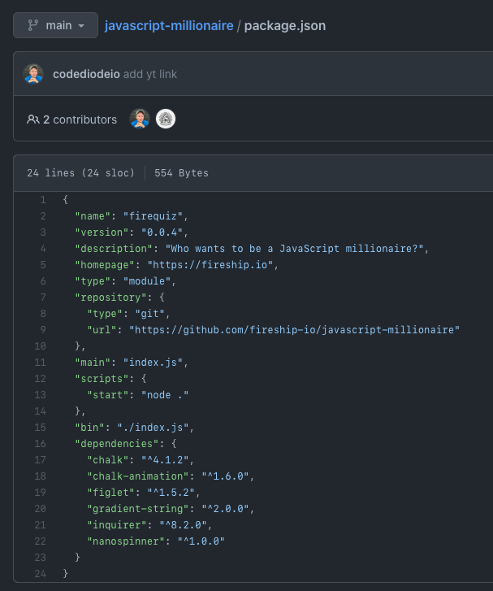

# JavaScript Millionaire CLI Tool
### Keywords: javascript #programming #game

The following `JavaScript` repository is forked form
- [javaScriptMillionaire](https://github.com/fireship-io/javascript-millionaire)
contains several good `JS` practices that I want to address.

## My Notes

- [x] Under the `package.json` which is configured using the `npm` library. In
  this file, the author used an attribute called `"type": "module"` this will allow to use the `import` in each `JS` module (a feature in `ES6+`)

- [x] It has also a style CLI which is similar to the one from `rich` in python
  to automate the common tasks in `JavaScript` projects.

## Video related

## 🔗  Resources

- [ Chalk ](https://github.com/chalk/chalk)
- [ Inquirer ](https://github.com/SBoudrias/Inquirer...)
- [ Colors.js Controversy ](https://www.theverge.com/2022/1/9/228...)
- [ Source Code ](https://github.com/fireship-io/javasc...)
